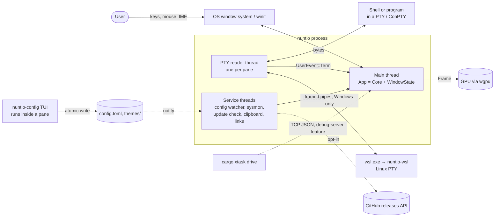
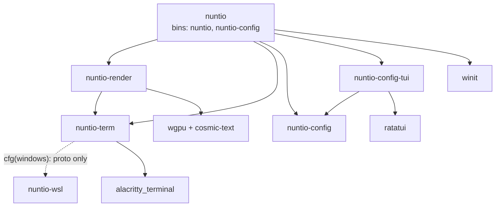
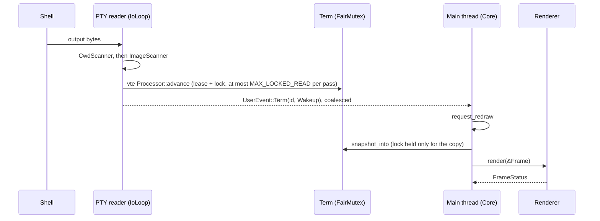
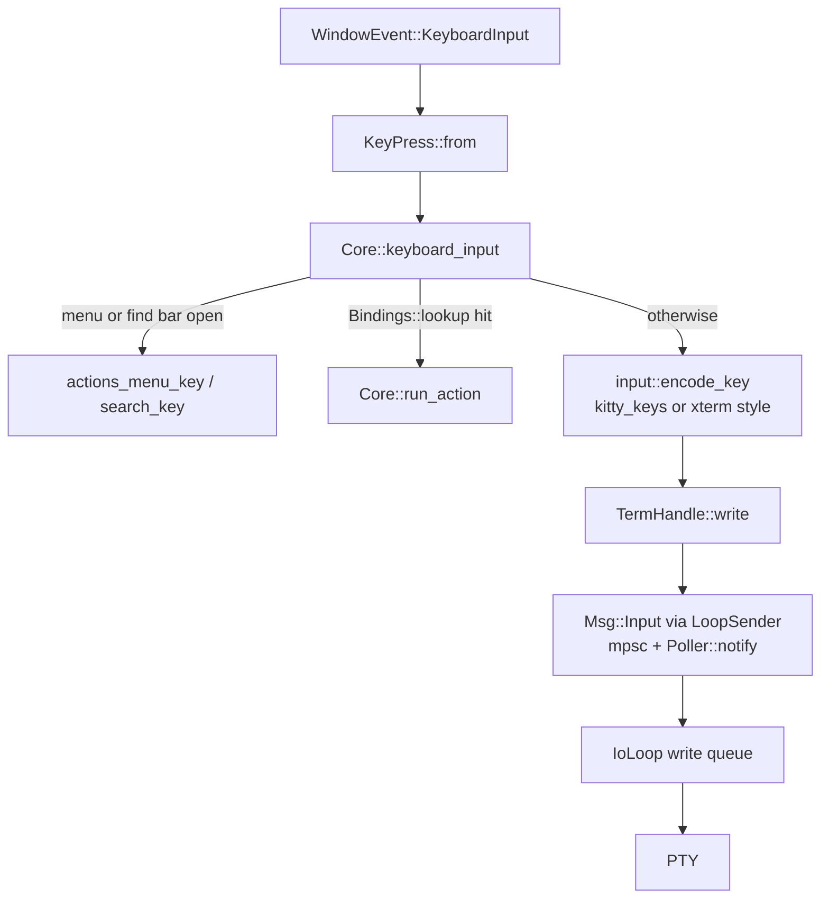
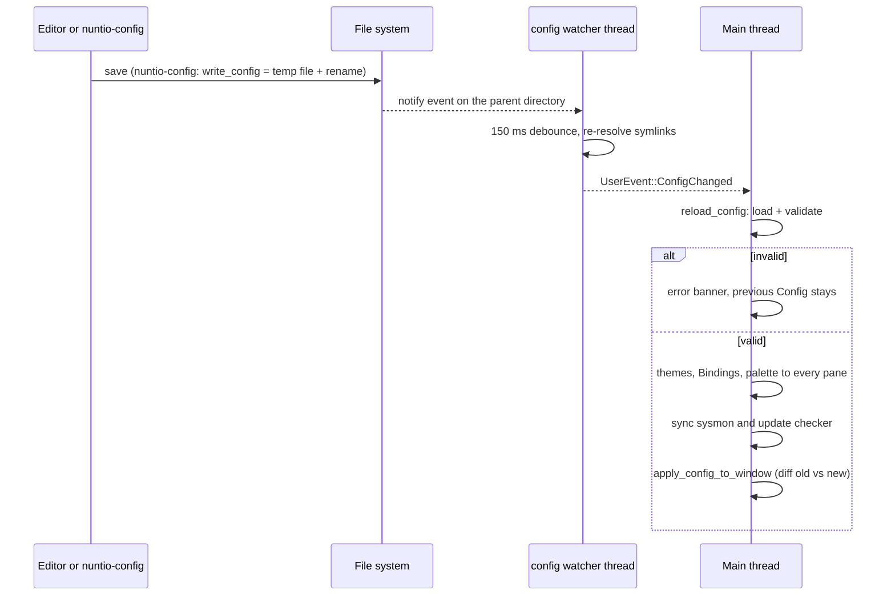
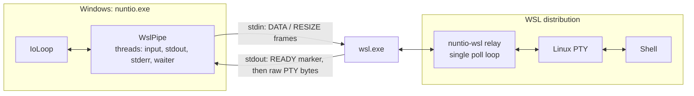

# Architecture

This document describes how nuntio's processes, threads and crates fit together and how data moves between them. It is written for contributors who want to change nuntio and need the big picture first.

- [README.md](README.md): features and usage
- [CONTRIBUTING.md](CONTRIBUTING.md): building, testing, commit conventions
- [docs/config.md](docs/config.md): every setting
- [AGENTS.md](AGENTS.md): the `cargo xtask drive` workflow for driving a running nuntio

Contents:
[System overview](#system-overview) ·
[Workspace and crate boundaries](#workspace-and-crate-boundaries) ·
[Threads and events](#threads-and-events) ·
[Main-thread state](#main-thread-state) ·
[Output path](#output-path-pty-to-pixels) ·
[Input path](#input-path) ·
[Rendering](#rendering) ·
[Idle and timers](#idle-and-timers) ·
[Pane lifecycle](#pane-lifecycle) ·
[Inline images](#inline-images) ·
[Configuration and hot reload](#configuration-and-hot-reload) ·
[nuntio-config](#nuntio-config-settings-tui) ·
[WSL panes](#wsl-panes-on-windows) ·
[Platform differences](#platform-differences) ·
[Background services](#background-services) ·
[Debug server](#debug-server-and-drive) ·
[Build and release](#build-packaging-and-release) ·
[Invariants](#invariants) ·
[Where to change what](#where-to-change-what)

## System overview

nuntio is a single-window terminal emulator with tabs and split panes. Terminal emulation (parsing, grid, scrollback) is done by `alacritty_terminal`; nuntio adds the PTY handling, inline images, the window, the UI around the panes and a GPU renderer built on wgpu. Configuration is a TOML file that is reloaded while nuntio runs.



## Workspace and crate boundaries



|Crate|Owns|Must not know about|
|---|---|---|
|[`nuntio`](crates/nuntio)|The winit loop, `App`/`Core`/`WindowState`, tabs, `PaneTree`, input encoding, actions, overlays (tab bar, status bar, find bar, banner, menus), background services, the debug server. No lib target: `app_input.rs`, `app_panes.rs` and `debug_server.rs` are child modules of `app.rs` via `#[path]`, so they reach private `Core` state.|—|
|[`nuntio-term`](crates/nuntio-term)|One PTY and IO thread per pane, ownership of the `Term`, image scanning, decoding and storage, `Snapshot`, palette, search, URLs, cwd and foreground process.|winit, wgpu|
|[`nuntio-render`](crates/nuntio-render)|wgpu, fonts, glyph and image atlases. Input is only a `Frame` and `nuntio_term::Snapshot`.|config, tabs, winit beyond raw window handles|
|[`nuntio-config`](crates/nuntio-config)|Config types, `schema.rs`, loading and validation, `edit.rs`, themes, `keys.rs`, the file watcher, shell and WSL detection (`detect.rs`).|any other nuntio crate|
|[`nuntio-config-tui`](crates/nuntio-config-tui)|The ratatui settings editor; its logic in `state.rs` sits behind the `Store` trait.|the running nuntio|
|[`nuntio-wsl`](crates/nuntio-wsl)|The Linux-only relay binary and `proto`, which nuntio-term shares on Windows.|nuntio internals|
|[`xtask`](xtask)|Icons, packaging, changelog, website, `drive`.|nuntio crates: it talks via processes, files and TCP|

Binaries: `nuntio` is a GUI-subsystem binary in release builds on Windows. `nuntio-config` ([`crates/nuntio/src/bin/nuntio-config.rs`](crates/nuntio/src/bin/nuntio-config.rs)) is a shim that calls `nuntio_config_tui::main()` and is a console program on every OS. `nuntio-wsl` is built for Linux only.

Design rule: pure logic (tabs, pane tree, tab bar layout, key and mouse encoding, config parsing) stays free of GPU and window types, so it can be unit-tested.

## Threads and events

Only the main thread touches the window, the `Renderer` (which holds `Rc` and is not `Send`), tabs and panes. Every other thread reaches it only through `EventLoopProxy<UserEvent>::send_event`.

|Name|Spawned in|Job|Ends when|
|---|---|---|---|
|main|`main::run` → `run_app`|runs winit|process exit|
|`PTY reader`|`nuntio-term` `IoLoop::spawn`|one per pane: polls the backend, parses into `Term`, writes input|`Msg::Shutdown` or child exit|
|unnamed scoped worker|`IoLoop` `decode_serving`|decodes one image while the PTY thread keeps serving|the decode finishes|
|`nuntio-wsl input/stdout/stderr/waiter`|`wsl_pipe.rs` (Windows)|the pipe transport of WSL panes|the pane closes|
|`config watcher`|`nuntio-config` `watch.rs`|debounces notify events, calls `on_change`|`ConfigWatcher` dropped (it holds only a `Weak`)|
|`sysmon`|`sysmon.rs` `SystemMonitor::start`|samples for the status bar|`SystemMonitor` dropped|
|`update-check`|`update.rs` `Checker::start`|the periodic release check|`Checker` dropped|
|`update-check-now`|`update::check_now`|one manual check|after one check|
|`clipboard-read`|`Core::request_paste`|reads the clipboard off the main thread|after one read|
|`link-open`|`Core::open_url`|runs `link::check` and opens the link|after one link|
|`font preload`|`nuntio_render::preload_fonts`|builds the `FontSystem` while the window and GPU start|joined by `Fonts::new`|
|`debug-server` + one unnamed thread per connection|`debug_server::start` (feature)|the TCP accept loop / `serve`|process exit / connection close|

`UserEvent` ([`crates/nuntio/src/event.rs`](crates/nuntio/src/event.rs)):

|Variant|Sender|Handler|
|---|---|---|
|`Term(PaneId, TermEvent)`|PTY thread, via the callback passed to `TermHandle::spawn`|`Core::term_event`|
|`ConfigChanged`|config watcher|`reload_config`|
|`SystemStats(Sample)`|sysmon|status bar; redraw only if `status_bar_changed`|
|`Update(Checked)`|update threads|`update_checked`|
|`Menu(MenuCommand)`|macOS menu target|`run_action` / `request_close`|
|`Debug(DebugCall)` (feature `debug-server`)|debug connections|`debug_call`|
|`Paste(ClipboardPaste)`|clipboard-read|`clipboard_pasted`|
|`LinkFailed(String)`|link-open|banner|

`TermEvent` handling on the main thread:

- `Wakeup`: redraw, or set the `activity` flag on a background tab.
- `TitleChanged`: `take_title`.
- `Bell`: `ack_bell` and a window attention request.
- `Exit`: `close_pane`.
- `ClipboardStore`: OSC 52 → clipboard.
- `ColorQuery`: `answer_color_queries`.
- `HelperFailed` (Windows): banner.

## Main-thread state

`App { core: Core, state: Option<WindowState> }` ([`crates/nuntio/src/app.rs`](crates/nuntio/src/app.rs)). `WindowState` is created in `resumed()` by `Core::create_window`.

The split exists so handlers can borrow both halves at once. `Core` holds everything that isn't window state: config, themes, palette, bindings, banner, services, clipboard, pending close and paste, the pane id counter and the startup args. `WindowState` ([`crates/nuntio/src/window.rs`](crates/nuntio/src/window.rs)) holds the window, the renderer, `Tabs<TabContent>`, chrome, mouse/IME/menu/find-bar state, timers and the `shot_pool`.

Ownership: `Tabs<TabContent>` → `TabContent { tree: PaneTree, panes: Vec<Pane>, focused }` → `Pane { id, term: TermHandle, … }`.

`PaneTree` ([`crates/nuntio/src/pane_tree.rs`](crates/nuntio/src/pane_tree.rs)):

- `Node::Leaf(PaneId) | Node::Split { axis, ratio, first, second }`, plus `zoomed: Option<PaneId>`.
- `layout(area, gap)` returns the pane rects and dividers.
- `neighbor` finds the next pane in a direction by geometry.

`Tabs::close` refuses to close the last tab; the app sets `exit_requested` instead.

## Output path: PTY to pixels



- Read pipeline ([`crates/nuntio-term/src/io_loop.rs`](crates/nuntio-term/src/io_loop.rs)): `CwdScanner` (OSC 7 / OSC 9;9 → `ReportedDir`) → `ImageScanner` (takes out OSC 1337 `File=` and `CSI 16 t`) → the `alacritty_terminal` vte parser.
- Term lock: `term.lease()` reserves the next turn of the `FairMutex`. The lock is released after `MAX_LOCKED_READ` bytes, so the main thread can draw during floods.
- Wakeups are coalesced: `wakeup_pending` is cleared by the next snapshot. DEC 2026 synchronized updates hold the wakeup until the update ends or `sync_timeout` fires.
- No damage tracking: each frame copies the whole visible grid into a pooled `Snapshot` (`WindowState::shot_pool`); `Snapshot::refresh` resolves colors, selection and search highlights.
- Frame assembly is in [`window_frame.rs`](crates/nuntio/src/window_frame.rs) (`with_frame`): pane snapshots; an overlay layer in the order tab bar, dividers, status bar, find bar, link hint, banner; a popup layer for menus. The result is `Frame { background, background_opacity, panes, rects, texts, popup_rects, popup_texts, corner_radius }`.
- Reveal: a new tab or split keeps showing the old frame until the shell's output pauses or `REVEAL_MAX` passes (`reveal_holds`), so the user doesn't see a half-drawn prompt.

## Input path



- `Bindings::from_config` puts config entries before `platform_defaults` (Cmd on macOS, Ctrl/Ctrl+Shift elsewhere); the first match wins.
- Key and action names are parsed in `nuntio-config` (`KeyCombo`, `ACTIONS`); `nuntio::actions` maps them to `Action`.
- `run_action` is the single dispatcher for keys, menus, the macOS menu bar and the debug server.
- Mouse: `mouse_press` tries, in order:
  1. the open menu,
  2. the banner,
  3. window chrome (tab bar, resize edges, drag),
  4. status items,
  5. links,
  6. dividers,
  7. pane focus.

  Then it either reports to the program (`mouse::encode_report`: X10, SGR 1006, UTF-8 1005; reporting is bypassed while Shift is held) or starts a selection.
- Paste:
  1. The `clipboard-read` thread reads the clipboard and sends `UserEvent::Paste`.
  2. `confirm_paste`: multi-line text without bracketed paste needs a second paste to confirm.
  3. `TermHandle::paste` sends it.
  4. Images go to `PastedImages`, which writes a PNG and pastes its path, quoted by `shell_words::PathSyntax`.
- Terminal replies (DA, `CSI 16 t`, OSC color queries) go through the `Listener` reply queue, capped by `ReplyBudget`. Color queries are answered on the main thread (`answer_color_queries`); later replies queue behind them to keep the order.

## Rendering

`Renderer` ([`crates/nuntio-render`](crates/nuntio-render)):

- `new`, `render(&Frame) -> FrameStatus`, `resize`.
- `set_font_family` / `set_font_size` clear the glyph caches.
- `release_surface` / `restore_surface` let a successor renderer take over the window (software fallback when `window.gpu_acceleration` changes).
- `capture` (feature `capture`) renders offscreen.

Pipeline:

- One instanced-quad shader, `quad.wgsl`. An `Instance` holds position, size, uv, color and kind. Kinds: `KIND_SOLID`, `KIND_MASK`, `KIND_COLOR`, `KIND_ROUNDED`, `KIND_IMAGE`, `KIND_IMAGE_SCALED`.
- Three pipelines: alpha blend; `fill` (REPLACE, for a pane's own background); `cutout` (transparent rounded window corners).
- One render pass. Each pane is scissored to its area. Draw order inside a pane: backgrounds → images → cursor → underline/strikeout → glyphs → dim veil. Then the UI, popups and cutouts.

Atlases (`atlas.rs`, etagere): mask (R8), color (RGBA, emoji) and image (RGBA). When full they grow, then clear, then skip missing glyphs. Glyph and cluster sprites are cached in `HashMap`s; images are cached by `TermImage::uid` and uploaded once.

Glyphs come from cosmic-text (shaping, fallback, emoji vs text presentation). Box drawing, Powerline and media symbols are drawn procedurally (`box_drawing.rs`), as are curly, dotted and dashed underlines (`decoration.rs`).

Color: the surface format is forced to non-sRGB, so theme sRGB values reach the screen unchanged. On macOS the `CAMetalLayer` colorspace is set to sRGB.

GPU selection honors `WGPU_BACKEND`, `WGPU_ADAPTER_NAME` and `WGPU_POWER_PREF`; adapters that can't present to the surface are skipped. On Windows, opaque windows prefer DX12 and present through DirectComposition (`dcomp.rs`); transparent windows stay on Vulkan.

`FrameStatus` handling in `Core::redraw_requested`:

- `Skipped`: retry, up to `MAX_FRAME_RETRIES`.
- `Paused` (occluded): wait for the next event.
- `Lost`: `rebuild_renderer`, up to `MAX_RENDERER_REBUILDS`, then a "GPU error" banner.

## Idle and timers

The loop runs with `ControlFlow::Wait`. In `about_to_wait`, `WindowState::run_timers` returns the earliest deadline (`WaitUntil`) of:

- the reveal,
- the cursor blink, only if the program asked for a blinking cursor,
- the tab-title refresh,
- autoscroll during a selection drag.

The status bar redraws only when its content changes, and `sysmon` pauses while the window is occluded. Invariant: an idle window uses ~0% CPU.

## Pane lifecycle

`Core::spawn_pane(dir, launch, size)` ([`crates/nuntio/src/app_panes.rs`](crates/nuntio/src/app_panes.rs)):

- `Launch::{Shell(ShellChoice), Command(argv), Settings(path)}`.
- Builds `SpawnOptions` with the `Transport` (`Pty`, or `WslHelper { fallback }` on Windows), `term_options`, the palette and the `pane_env` (`NUNTIO_CONFIG`, `PATH` with the helper dir, the macOS locale; empty for WSL).
- The event callback is `proxy.send_event(UserEvent::Term(id, ev))`.

`nuntio-term` sets `TERM=xterm-256color`, `COLORTERM`, `TERM_PROGRAM`, `PI_FORCE_IMAGE_PROTOCOL=iterm2` (not on native ConPTY) and `WINDOWID`. On macOS the shell is wrapped in `login(1)`.

Working directory for new tabs and splits, first hit wins:

1. the focused pane's cwd: from process info (`/proc` on Linux, `proc_pidinfo` on macOS), else the OSC-reported dir; translated between Windows and WSL paths;
2. `configured_dir`;
3. home.

Splits always inherit; tabs inherit only with `tabs.inherit_directory`.

Close:

1. `TermEvent::Exit` → `close_pane` → `PaneTree::remove` → `close_tab` when the tree is empty → exit on the last tab.
2. Dropping a `TermHandle` sends `Msg::Shutdown` and doesn't join the thread.
3. In `IoLoop`, `Backend` is the last field, because dropping the PTY can block until the child exits; the grid and images are freed first.
4. `ExitGuard` closes the pane even when the PTY thread panics.

`confirm_close` asks before closing when `foreground_is_shell() == Some(false)`. It doesn't apply on Windows and in WSL panes, where the foreground process isn't visible.

## Inline images

1. `ImageScanner` ([`image_scan.rs`](crates/nuntio-term/src/image_scan.rs)) cuts OSC 1337 `File=` sequences out of the stream before the parser sees them.
2. `parse_args` → `decode` runs on a scoped worker thread: base64, the `image` crate, EXIF orientation, scaling to cells, premultiplied RGBA.
3. The per-pane `ImageStore` dedupes by `ImageKey` and evicts by `IMAGE_MEMORY_BUDGET` / `IMAGE_MEMORY_LIMIT`.
4. `image::place` ([`image.rs`](crates/nuntio-term/src/image.rs)) writes placeholder cells: char `PLACEHOLDER` (U+10EEEE), fg = the 24-bit image id, and two zero-width marks for row and column. Images therefore scroll, reflow, clear and get overwritten like text.
5. `Snapshot.images` (runs of `ImagePiece`) feeds the renderer's image atlas.
6. `CSI 16 t` is answered with the cell size. Copy (`strip_image_text`) and URL detection skip placeholder cells.

## Configuration and hot reload

Loading ([`crates/nuntio-config/src/load.rs`](crates/nuntio-config/src/load.rs)):

- `--config`, else `locate_config`: `$XDG_CONFIG_HOME/nuntio/config.toml` or `~/.config/nuntio/config.toml`, else `~/.nuntio.toml`. Same paths on every OS.
- Unknown keys are warnings (`serde_ignored`).
- `Config::validate` uses the range constants from `schema.rs`.
- Errors keep the previous config and show a banner.

`SETTINGS` in [`schema.rs`](crates/nuntio-config/src/schema.rs) is the single source for every setting (kind, allowed values, help, platform). It drives the TUI, and tests keep it in sync with `Config::default()` and [docs/config.md](docs/config.md).



- The watcher watches directories, not files, because editors replace files atomically. It also watches the themes dir, symlink targets, and the closest existing ancestor of directories that don't exist yet.
- `apply_config_to_window` diffs old against new: a renderer rebuild on `gpu_acceleration`, font family and size, `set_options` for all panes on `term_options` changes, `resize_terms`.
- `restart_warnings` covers what can't change live: decorations, the macOS titlebar, opacity on a window created opaque.
- Never re-created on reload: the window and existing panes. Shell and profile settings affect only new panes. Everything read per frame (keybindings, status bar, `dim_inactive`) applies on the next frame.
- Themes: 20 built-ins via `include_str!` from [`crates/nuntio-config/themes/`](crates/nuntio-config/themes); user `themes/*.toml` and `*.itermcolors` override them by name; `ThemeSelection::Auto { light, dark }` follows winit's `ThemeChanged` (`Core::os_dark`).

## nuntio-config (settings TUI)

`nuntio-config` runs as a separate process inside a nuntio tab and is not linked into nuntio's event loop.

- `Action::OpenSettings` → `Launch::Settings(helper path)`. The helper lives in `pane_env::helper_dir` (next to the exe or in `../lib/nuntio`). It is never on the global PATH, only prepended to the PATH of nuntio's panes.
- Config path precedence: `--config`, then `NUNTIO_CONFIG`, then `locate_config`.
- The `App` sits behind the `Store` trait (`FileStore` in production, in-memory in tests).
- Every valid edit re-reads the file, applies the change via `ConfigDoc` (toml_edit, keeps comments), validates with `nuntio_config::parse` and writes immediately with `write_config`. `write_config` is atomic: temp file + rename, follows a symlink to its target, fsyncs the directory on Unix.
- There is no IPC: nuntio's watcher picks up the write, so hot reload is the live preview.

## WSL panes on Windows

ConPTY moves inline images to the wrong place, so WSL panes get a real Linux PTY through a helper running inside WSL.



Launch: `nuntio_config::Shell::command` builds

```text
wsl.exe -d <distro> [-u <user>] --cd <dir> --exec /bin/sh -c 'exec "$(wslpath -u "$0")" "$@"' <helper path> [-- <program> <args>]
```

Wire protocol ([`crates/nuntio-wsl/src/proto.rs`](crates/nuntio-wsl/src/proto.rs)):

- nuntio → helper (stdin): frames `[kind: u8][len: u32 LE][payload]`. `DATA = 0` carries input bytes; `RESIZE = 1` carries `columns, lines, cell_width, cell_height`, each u16 LE. A payload is at most `MAX_FRAME` (1 MiB). The first frame must be `RESIZE`.
- helper → nuntio (stdout): raw PTY bytes, preceded once by the marker `ESC ] nuntio-wsl;ready BEL`. stderr carries helper messages.

Relay ([`crates/nuntio-wsl/src/relay.rs`](crates/nuntio-wsl/src/relay.rs)):

- `openpty`, the shell as session leader (`setsid` + `TIOCSCTTY`).
- One `poll` loop over stdin, the PTY master and a SIGCHLD self-pipe.
- Back-pressure on input; stdin EOF hangs up the shell.
- Exit code 127 for a missing program, 2 for data before the first size.

Windows pipes can't be polled, so `WslPipe` ([`wsl_pipe.rs`](crates/nuntio-term/src/wsl_pipe.rs)) posts IOCP completion packets to the `Poller`. Output is buffered with a cap (back-pressure).

Fallback: if wsl.exe exits before READY, `BackendEvent::HelperFailed` → `IoLoop::fall_back` starts ConPTY with the same shell → `TermEvent::HelperFailed` shows a banner. Without a helper binary, WSL panes use plain ConPTY from the start.

Build: [`crates/nuntio/build.rs`](crates/nuntio/build.rs) cross-builds `nuntio-wsl` for `x86_64-unknown-linux-musl` (rust-lld) next to `nuntio.exe`. Without that target installed it only prints a cargo warning.

## Platform differences

|Concern|Linux|macOS|Windows|
|---|---|---|---|
|PTY|forkpty (alacritty `tty`)|forkpty + `login(1)`|ConPTY; WSL via `nuntio-wsl`|
|Default shell|`$SHELL` / passwd|`$SHELL` / passwd|`powershell`|
|Window chrome|System; undecorated with own rounded corners (transparent window) for `decorations = "custom"` or under WSLg, whose Weston crashes on winit's client-side decorations|`Chrome::TitlebarInset` or native titlebar; menu bar in `macos_menu.rs`|Undecorated custom chrome with DWM rounded corners, or system|
|Foreground process / cwd|`/proc`|`proc_pidinfo`|none (OSC 7 / 9;9 only)|
|Clipboard|arboard + primary selection (middle click)|arboard|arboard|
|GPU|Vulkan, GL only as fallback (avoids EGL noise on WSLg)|Metal, sRGB layer|DX12 + DirectComposition when opaque, else Vulkan|
|Startup errors|log only|NSAlert|MessageBoxW; `restrict_dll_search` against a foreign `conpty.dll`|
|Shortcut modifier|Ctrl+Shift|Cmd|Ctrl+Shift|

## Background services

- Status bar `sysmon`: started only if a placed `StatusItem` needs sampling (`sysmon::is_sampled`); synced on every reload.
- Update check ([`update.rs`](crates/nuntio/src/update.rs)):
  - opt-in: `[updates] check = true` plus at least one indicator;
  - GET `https://api.github.com/repos/cebor/nuntio/releases/latest`, using only `tag_name`, with conditional ETag requests;
  - state in the cache dir (`nuntio/update.toml`);
  - informs only (banner, tab-bar badge, status item); nothing is downloaded;
  - the wording depends on `NUNTIO_BUILD=release`, which `cargo xtask package` sets.
- Pasted images: a private temp dir per process; stale dirs from earlier runs are swept, the current one is removed in `exiting`.

## Debug server and drive

Feature `debug-server` (enables `nuntio-render/capture`), never in packages.

- Transport: `TcpListener` on 127.0.0.1 with a random port. The state file `{port, token, pid}` (mode 0600 on Unix) is written to the path given by `--debug-server <file>`. One JSON line per request (with the token), one JSON line per reply, plus raw RGBA bytes for screenshots.
- Each request becomes `UserEvent::Debug` and is handled on the main thread (`Core::debug_request`), so input goes through the real paths (`keyboard_input`, `mouse_input`, `run_action`).
- Screenshots use `Renderer::capture` offscreen, so they work while the window is covered. While the server is on, the window acts as focused.
- Headless: Xvfb via `xvfb-run` on Linux and WSL; `--headless` (off-screen, out of the taskbar) on Windows; a transparent window with the Accessory activation policy on macOS.
- The client is [`xtask/src/drive.rs`](xtask/src/drive.rs); [AGENTS.md](AGENTS.md) lists the commands.

## Build, packaging and release

Details in [CONTRIBUTING.md](CONTRIBUTING.md).

|OS|nuntio|nuntio-config|nuntio-wsl|
|---|---|---|---|
|Linux (tar.gz, deb, AppImage)|`bin/nuntio` (`/usr/bin`)|`lib/nuntio/nuntio-config`|—|
|macOS|`nuntio.app/Contents/MacOS/nuntio`|same directory|—|
|Windows (zip, installer)|`nuntio.exe`|`nuntio-config.exe` next to it|`nuntio-wsl` (musl ELF) next to it|

- CI ([`ci.yml`](.github/workflows/ci.yml)): fmt, clippy and tests on all three OSes, with and without `nuntio/debug-server`; MSRV; docs; cargo-deny; packages; site.
- [`release.yml`](.github/workflows/release.yml) on `v*` tags: version check → packages → GitHub release with notes from `cargo xtask changelog` (`Changelog:` trailers) → Pages rebuild.

## Invariants

- Only the main thread owns the window, the renderer and the panes; other threads send `UserEvent`.
- The term lock is held only to parse a bounded chunk or to copy a snapshot.
- Lock order: term first, then images/replies.
- Idle CPU stays at ~0: redraw only on events or timer deadlines.
- Pure logic stays free of GPU and window types and is unit-tested.
- Every setting has a `schema.rs` entry and a `docs/config.md` row (enforced by tests).
- `nuntio-config` is never on the global PATH.
- An invalid config never replaces a valid one.
- Library crates use `thiserror`, the binary uses `anyhow`, logging uses `tracing`.

## Where to change what

|Task|Touch|
|---|---|
|New action|`Action` + `NAMES` (`actions.rs`), `Bindings::platform_defaults`, `Core::run_action`, `actions_menu::MENU`, `nuntio_config::ACTIONS`, the actions table in the docs|
|New setting|the `Config` type, `SETTINGS` in `schema.rs`, `docs/config.md`; apply it in `reload_config` / `apply_config_to_window` or read it per frame|
|New status item|`nuntio_config::StatusItem`, `status_bar.rs`, `sysmon::is_sampled` / `Sample` if it samples, the click in `mouse_press`|
|New background source|a `UserEvent` variant in `event.rs`, an arm in `App::user_event`, send through a cloned proxy|
|New quad kind|a `KIND_*` constant in both `renderer.rs` and `quad.wgsl` (duplicated on purpose; keep them equal)|
|New procedural glyph|`box_drawing::rasterize`|
|New underline style|`decoration.rs` + `push_underline`|
|New escape sequence nuntio intercepts|`image_scan.rs` (before the parser) or `osc_cwd.rs`; everything else belongs to `alacritty_terminal`|
|New debug command|`debug_server::Request`, `Core::debug_request`, `xtask/src/drive.rs`|
|New built-in theme|a file in `crates/nuntio-config/themes/`, the `BUILTIN` array in `theme.rs`, the theme list in the docs|
