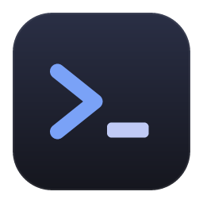
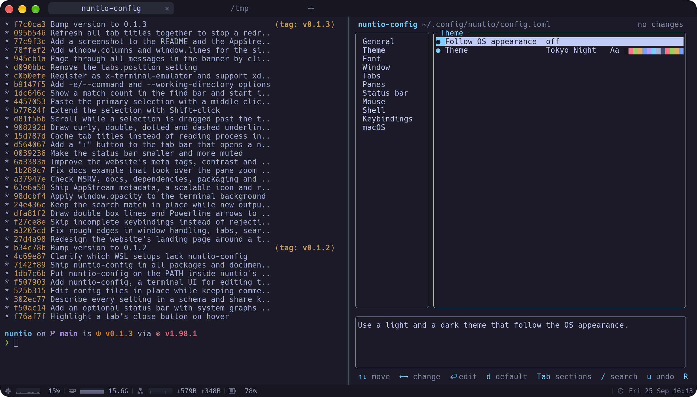
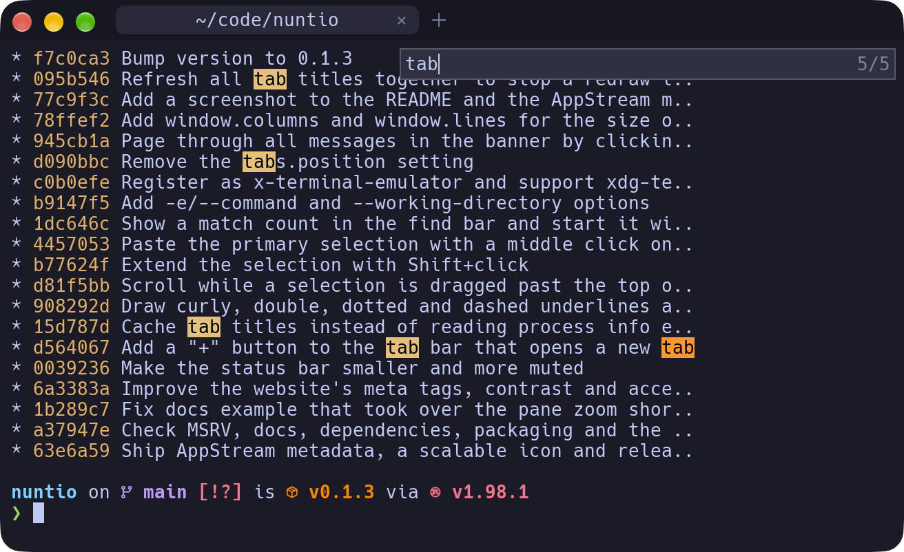
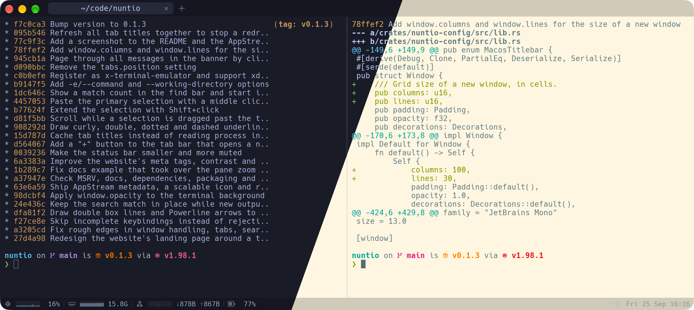

<p align="center">
  
</p>

<h1 align="center">nuntio</h1>

<p align="center">
  A fast, GPU-rendered terminal emulator for Linux, macOS and Windows, modeled on iTerm2.
</p>

<p align="center">
  <a href="https://github.com/cebor/nuntio/actions/workflows/ci.yml"></a>
  
  
  <a href="#license"></a>
</p>

<p align="center">
  <a href="https://cebor.github.io/nuntio/">Website</a> ·
  <a href="#features">Features</a> ·
  <a href="#installation">Installation</a> ·
  <a href="#configuration">Configuration</a> ·
  <a href="#keyboard-shortcuts">Shortcuts</a> ·
  <a href="CONTRIBUTING.md">Contributing</a>
</p>

---

nuntio is one window with tabs and split panes, rendered on the GPU and configured with a single TOML file that reloads while you type. Terminal emulation comes from [`alacritty_terminal`](https://crates.io/crates/alacritty_terminal); everything around it (window, tabs, panes, rendering, config) is nuntio's own.



## Features

- **GPU rendering** with [wgpu](https://wgpu.rs): a single instanced-quad pipeline draws backgrounds, glyphs and UI. Box-drawing characters are drawn procedurally, so TUI borders line up without gaps.
- **Text** shaped with [cosmic-text](https://github.com/pop-os/cosmic-text): font fallback, color emoji, CJK and wide characters.
- **Tabs**: drag to reorder, middle-click to close, hidden while only one tab is open. Titles follow the shell's title or, on Linux, the foreground process.
- **Split panes**: split side by side or top and bottom, move focus and resize with the keyboard or by dragging dividers, zoom a pane to fill the tab. Inactive panes are dimmed.
- **New tabs and panes open in the current directory** of the focused pane (Linux).
- **Find bar** with incremental search, a match count and a regex mode (<kbd>Alt</kbd>+<kbd>R</kbd>). It starts with the selected text, if there is one.
- **Drag and drop**: drop files onto a pane to type their paths, escaped for the shell.
- **Clickable URLs**: hold <kbd>Ctrl</kbd> (<kbd>Cmd</kbd> on macOS) and click. While hovering, the address the link leads to is shown, and links to programs are not opened.
- **Themes**: five built in, your own as TOML or iTerm2 `.itermcolors`, and a light/dark pair that follows the OS appearance.
- **WSL**: `shell = { wsl = "Ubuntu" }` opens every tab straight in a WSL distribution on Windows.
- **Config editor**: run `nuntio-config` in a nuntio tab to change settings in a terminal UI that only offers valid values and previews every change live.
- **Hot reload**: saving the config applies it right away. Mistakes show up as a banner in the window, and the previous settings stay active.
- **Mouse reporting** (X10, SGR 1006, UTF-8 1005), bracketed paste, IME input, copy on select. <kbd>Shift</kbd>+click extends a selection, and on Linux a middle click pastes the last selection.
- **Status bar** (optional): live graphs of CPU, memory and network, the battery level and the time, as in iTerm2.
- **Idle means idle**: nuntio only redraws when something changed, so an idle window uses close to 0% CPU.



## Installation

Download the package for your platform from the [latest release](https://github.com/cebor/nuntio/releases/latest):

| Platform | Package | Install |
|---|---|---|
| macOS (Intel and Apple Silicon) | `nuntio-<version>-macos-universal.dmg` | Open the image and drag nuntio to Applications |
| Linux (Debian / Ubuntu) | `nuntio_<version>-1_amd64.deb` | `sudo apt install ./nuntio_<version>-1_amd64.deb` |
| Linux (any distribution) | `nuntio-<version>-x86_64-linux.AppImage` | `chmod +x` it and run it |
| Linux (any distribution) | `nuntio-<version>-x86_64-linux.tar.gz` | Unpack it; it contains `bin/`, a desktop file and icons |
| Windows | `nuntio-<version>-x86_64-windows.zip` | Unpack it and run `nuntio.exe` |

The packages are not signed yet. On macOS, the first start is blocked: allow it in **System Settings** → **Privacy & Security** → **Open Anyway**, or run `xattr -dr com.apple.quarantine /Applications/nuntio.app` (right-click → **Open** no longer works since macOS 15). On Windows, SmartScreen may ask you to confirm with **More info** → **Run anyway**.

### Build from source

You need current stable Rust; `rust-toolchain.toml` selects the stable channel with rustfmt and clippy, and `rustup` installs it automatically. On Linux you also need the windowing development packages:

```sh
# Debian / Ubuntu
sudo apt-get install libxkbcommon-dev libwayland-dev libx11-dev libxcursor-dev libxrandr-dev libxi-dev
```

Then:

```sh
git clone https://github.com/cebor/nuntio.git
cd nuntio
cargo run -r
```

### Building packages

`cargo xtask package` builds a release and writes packages for the host OS to `dist/`. The release workflow runs the same command for every `v*` tag.

| Platform | Output |
|---|---|
| Linux | `.tar.gz`, plus `.deb` if [`cargo-deb`](https://crates.io/crates/cargo-deb) is installed and `.AppImage` if `appimagetool` is available |
| macOS | universal (Intel + Apple Silicon) `.app` in a `.dmg` |
| Windows | `.zip` |

### Command line

```text
nuntio [options] [[-e] <command> [<args>...]]
```

| Flag | Description |
|---|---|
| `-e`, `--command <command> [<args>...]` | Run a command instead of the shell in the first tab, e.g. `nuntio -e htop`. Everything after it goes to the command. The window closes when it exits |
| `--working-directory <dir>` | Start the first tab in this directory |
| `--config <path>` | Use this config file instead of the default location |
| `--log-level <level>` | Log filter such as `debug` or `nuntio=trace` (`RUST_LOG` also works) |
| `-V`, `--version` | Print the version |
| `-h`, `--help` | Print the options |

When nuntio is started without a terminal (from a desktop launcher, for example), it logs to `nuntio/nuntio.log` in the platform's cache directory, such as `~/.cache/nuntio/nuntio.log` on Linux. The previous run's log is kept as `nuntio.old.log`.

## Configuration

nuntio reads `~/.config/nuntio/config.toml` (or `$XDG_CONFIG_HOME/nuntio/config.toml`) or, if that doesn't exist, `~/.nuntio.toml`. The paths are the same on Linux, macOS and Windows, so one dotfiles repo works everywhere. Without a config file, nuntio runs with the defaults.

```toml
[font]
family = "JetBrains Mono"
size = 14.0

# Follow the OS appearance
[theme]
light = "Solarized Light"
dark = "Tokyo Night"

[panes]
dim_inactive = 0.2

[[keybindings]]
key = "Ctrl+Shift+N"
action = "new_tab"
```



Changes apply as soon as you save the file. Or run `nuntio-config` in a nuntio tab and change settings in a terminal UI instead of editing TOML. The **[configuration reference](docs/config.md)** covers every option with its default, custom themes, and all keybinding actions.

## Keyboard shortcuts

On macOS, nuntio uses iTerm2's shortcuts. On Linux and Windows, most shortcuts add <kbd>Shift</kbd> so that plain <kbd>Ctrl</kbd> combinations still reach the shell. All shortcuts can be changed or disabled in the [config](docs/config.md#keybindings).

| Action | Linux / Windows | macOS |
|---|---|---|
| Copy / paste | <kbd>Ctrl</kbd><kbd>Shift</kbd><kbd>C</kbd> / <kbd>Ctrl</kbd><kbd>Shift</kbd><kbd>V</kbd> | <kbd>Cmd</kbd><kbd>C</kbd> / <kbd>Cmd</kbd><kbd>V</kbd> |
| Paste | <kbd>Shift</kbd><kbd>Insert</kbd> | <kbd>Shift</kbd><kbd>Insert</kbd> |
| New tab | <kbd>Ctrl</kbd><kbd>Shift</kbd><kbd>T</kbd> | <kbd>Cmd</kbd><kbd>T</kbd> |
| Close pane (or tab) | <kbd>Ctrl</kbd><kbd>Shift</kbd><kbd>W</kbd> | <kbd>Cmd</kbd><kbd>W</kbd> |
| Next / previous tab | <kbd>Ctrl</kbd><kbd>Tab</kbd> / <kbd>Ctrl</kbd><kbd>Shift</kbd><kbd>Tab</kbd> | <kbd>Cmd</kbd><kbd>Shift</kbd><kbd>]</kbd> / <kbd>Cmd</kbd><kbd>Shift</kbd><kbd>[</kbd> |
| Go to tab 1–9 | <kbd>Alt</kbd><kbd>1</kbd> … <kbd>Alt</kbd><kbd>9</kbd> | <kbd>Cmd</kbd><kbd>1</kbd> … <kbd>Cmd</kbd><kbd>9</kbd> |
| Split side by side | <kbd>Ctrl</kbd><kbd>Shift</kbd><kbd>D</kbd> | <kbd>Cmd</kbd><kbd>D</kbd> |
| Split top / bottom | <kbd>Ctrl</kbd><kbd>Shift</kbd><kbd>E</kbd> | <kbd>Cmd</kbd><kbd>Shift</kbd><kbd>D</kbd> |
| Focus pane | <kbd>Ctrl</kbd><kbd>Alt</kbd><kbd>←↑→↓</kbd> | <kbd>Cmd</kbd><kbd>Opt</kbd><kbd>←↑→↓</kbd> |
| Resize pane | <kbd>Ctrl</kbd><kbd>Alt</kbd><kbd>Shift</kbd><kbd>←↑→↓</kbd> | <kbd>Cmd</kbd><kbd>Ctrl</kbd><kbd>←↑→↓</kbd> |
| Zoom pane | <kbd>Ctrl</kbd><kbd>Shift</kbd><kbd>Enter</kbd> | <kbd>Cmd</kbd><kbd>Shift</kbd><kbd>Enter</kbd> |
| Find | <kbd>Ctrl</kbd><kbd>Shift</kbd><kbd>F</kbd> | <kbd>Cmd</kbd><kbd>F</kbd> |
| Font size bigger / smaller / reset | <kbd>Ctrl</kbd><kbd>+</kbd> / <kbd>Ctrl</kbd><kbd>-</kbd> / <kbd>Ctrl</kbd><kbd>0</kbd> | <kbd>Cmd</kbd><kbd>+</kbd> / <kbd>Cmd</kbd><kbd>-</kbd> / <kbd>Cmd</kbd><kbd>0</kbd> |
| Full screen | <kbd>F11</kbd> | <kbd>Ctrl</kbd><kbd>Cmd</kbd><kbd>F</kbd> |
| Clear scrollback | <kbd>Ctrl</kbd><kbd>Shift</kbd><kbd>K</kbd> | <kbd>Cmd</kbd><kbd>K</kbd> |
| Scroll a page | <kbd>Shift</kbd><kbd>PgUp</kbd> / <kbd>Shift</kbd><kbd>PgDn</kbd> | <kbd>Shift</kbd><kbd>PgUp</kbd> / <kbd>Shift</kbd><kbd>PgDn</kbd> |
| Scroll a line | <kbd>Ctrl</kbd><kbd>Shift</kbd><kbd>↑</kbd> / <kbd>↓</kbd> | <kbd>Cmd</kbd><kbd>↑</kbd> / <kbd>↓</kbd> |
| Reload config | <kbd>Ctrl</kbd><kbd>Shift</kbd><kbd>,</kbd> | <kbd>Cmd</kbd><kbd>Shift</kbd><kbd>,</kbd> |
| Open `nuntio-config` | – | <kbd>Cmd</kbd><kbd>,</kbd> |

In the find bar, <kbd>Enter</kbd> jumps to the next match, <kbd>Shift</kbd><kbd>Enter</kbd> to the previous one, <kbd>Alt</kbd><kbd>R</kbd> toggles regex mode and <kbd>Esc</kbd> closes the bar.

## Architecture

<details>
<summary>Workspace layout</summary>

| Crate | Role |
|---|---|
| [`crates/nuntio`](crates/nuntio) | The binary: winit event loop, window and layout, tabs, split tree, key and mouse encoding, shortcuts, tab bar, find bar and banners |
| [`crates/nuntio-term`](crates/nuntio-term) | Wrapper around `alacritty_terminal`: a PTY and IO thread per pane, snapshots of the visible screen, palette, search, URL detection, foreground process info |
| [`crates/nuntio-render`](crates/nuntio-render) | wgpu renderer: instanced quads for backgrounds, glyphs (cosmic-text, R8 + RGBA atlases) and UI; procedural box drawing |
| [`crates/nuntio-config`](crates/nuntio-config) | Config schema, loading and validation, editing in place, themes (built-in TOML and `.itermcolors`), file watcher |
| [`crates/nuntio-config-tui`](crates/nuntio-config-tui) | The `nuntio-config` editor: a ratatui terminal UI built on the schema |
| [`xtask`](xtask) | Icons, packaging, changelog |

PTY threads send events through the winit event loop proxy. The main thread takes a snapshot of each visible pane, holding the terminal lock only for the copy, and hands one frame to the renderer. It redraws only when something changed.

</details>

## Contributing

Contributions are welcome. [CONTRIBUTING.md](CONTRIBUTING.md) explains how to build, test and write commits. The changelog is generated from `Changelog:` commit trailers.

## License

nuntio is licensed under either of

- [Apache License, Version 2.0](LICENSE-APACHE)
- [MIT License](LICENSE-MIT)

at your option.
