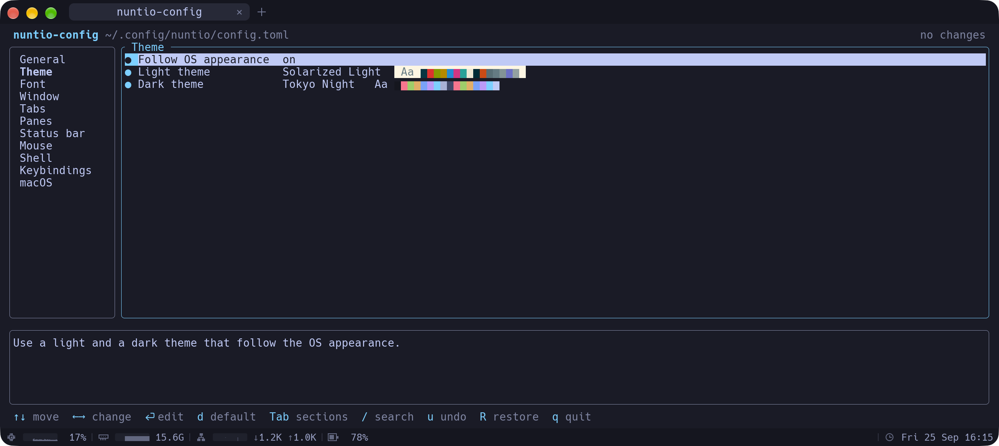

# Configuration reference

nuntio is configured with a single TOML file. Every setting is optional, so an empty or missing file gives you the defaults.

- [Location](#location)
- [Editing in the terminal](#editing-in-the-terminal)
- [Reloading](#reloading)
- [Full example](#full-example)
- [Options](#options)
- [Themes](#themes)
- [Keybindings](#keybindings)

## Location

nuntio uses the first of these files that exists:

1. `~/.config/nuntio/config.toml`, or `$XDG_CONFIG_HOME/nuntio/config.toml` if `XDG_CONFIG_HOME` is set to an absolute path
2. `~/.nuntio.toml`

If neither exists, nuntio runs with the defaults. A `config.toml` you then create in an existing `~/.config/nuntio/` directory is picked up right away; a new `~/.nuntio.toml` takes effect when you restart nuntio. If both exist, `~/.nuntio.toml` is ignored and a warning says so. `nuntio --config <path>` skips the lookup and uses the given file.

The paths are the same on Linux, macOS and Windows (on Windows, `~` is your user profile folder, e.g. `C:\Users\<name>`), so one dotfiles setup works everywhere. Symlinked config files are supported.

Custom themes go in a `themes/` directory next to the config file, for example `~/.config/nuntio/themes/`. With `~/.nuntio.toml`, they still go in `~/.config/nuntio/themes/`.

## Editing in the terminal

Run `nuntio-config` in a nuntio tab to change settings without editing TOML by hand. The command exists only inside nuntio, and it edits the config file this nuntio uses, including one given with `--config`.

- Settings are grouped by section. Choices offer only valid values: the variants of an option, your installed themes (with a color preview) and monospace fonts, and the keybinding actions. Numbers stay within their range.
- Every change is written right away and applied by hot reload, so you see it in the window as you go. A change that would make the file invalid is refused with the reason.
- Comments and the layout of your file are kept. Resetting a setting to its default removes it from the file.
- A `●` marks settings that are set in the file.



| Key | Action |
|---|---|
| <kbd>↑</kbd> <kbd>↓</kbd> | Move |
| <kbd>←</kbd> <kbd>→</kbd> | Step a number, cycle a choice, toggle a switch |
| <kbd>Enter</kbd> | Edit: open the list of choices, the text input or the checklist |
| <kbd>Space</kbd> | Toggle a switch |
| <kbd>Tab</kbd> | Switch between sections and settings |
| <kbd>d</kbd> | Reset to the default (in keybindings: delete the entry) |
| <kbd>a</kbd> | Add a keybinding |
| <kbd>/</kbd> | Search all settings |
| <kbd>u</kbd> | Undo |
| <kbd>R</kbd> | Restore the file as it was when `nuntio-config` started |
| <kbd>q</kbd> | Quit |

In a list of choices, typing filters it; moving through themes or fonts previews each one, <kbd>Enter</kbd> keeps it and <kbd>Esc</kbd> goes back. The font list also accepts any name you type. In the status bar items, <kbd>Space</kbd> shows or hides an item and <kbd>Shift</kbd><kbd>↑</kbd>/<kbd>↓</kbd> moves it. <kbd>S</kbd> adds a spring below the cursor and <kbd>D</kbd> removes one; a line above the list sketches the bar.

A key combination for a keybinding is typed as text, like `Ctrl+Shift+Enter` (see [Key syntax](#key-syntax)), because a terminal can't report every combination reliably. The editor checks it as you type and warns when the combination is already bound.

If you edit the file in another editor while `nuntio-config` is open, it reloads the file before the next change. On Windows, shells that `shell.wsl` starts in a WSL distribution don't get the command. nuntio running inside WSL itself (WSLg) is not affected.

## Reloading

nuntio watches the config file and the `themes/` directory and applies changes as soon as you save. You can also reload manually with <kbd>Ctrl</kbd><kbd>Shift</kbd><kbd>,</kbd> (<kbd>Cmd</kbd><kbd>Shift</kbd><kbd>,</kbd> on macOS).

- **Syntax and type errors** show a red banner with the line number. The previous settings stay active.
- **Invalid values** (for example a font size outside the allowed range) are handled the same way.
- **Unknown keys** (typos like `famliy`) show a warning banner. Everything else in the file is still applied.
- If the config is invalid at **startup**, nuntio starts with the defaults and shows the error.
- With several problems, the banner shows how many (`(1/3)`). Click it for the next one, or click the × to close it.

Most settings apply to open panes right away; `scrollback` too, and a smaller value drops the oldest lines. `shell` applies to panes opened after the change.

## Full example

This file lists every option with its default value:

```toml
# Program to run in new panes. Default: $SHELL on Linux and macOS
# (falling back to sh), PowerShell on Windows.
# shell = { program = "/bin/zsh", args = ["-l"] }
# On Windows, start in a WSL distribution instead, optionally as another user:
# shell = { wsl = "Ubuntu", wsl_user = "root" }

# Lines of history per pane.
scrollback = 10000

# Programs may copy to the clipboard (OSC 52).
clipboard_write = true

# Ask before pasting line breaks that would run commands at once.
confirm_paste = true

# Programs may turn on the kitty keyboard protocol.
kitty_keyboard = true

# One theme name…
theme = "iTerm2 Default"
# …or a pair that follows the OS appearance (replace the line above):
# theme = { light = "Solarized Light", dark = "Tokyo Night" }

[font]
# Any installed font. Default: the system's monospace font.
# family = "JetBrains Mono"
size = 13.0

[window]
# Size of a new window, in cells.
columns = 100
lines = 30
padding = { x = 8, y = 6 }
decorations = "custom"
# macOS only; derived from `decorations` unless set.
# macos_titlebar = "transparent"
opacity = 1.0
confirm_close = true

[tabs]
hide_when_single = true
title = "auto"

[panes]
dim_inactive = 0.15

[status_bar]
enabled = false
position = "bottom"
items = ["cpu", "memory", "network", "battery", "datetime"]
datetime_format = "%a %d %b %H:%M"

[mouse]
copy_on_select = false

[macos]
option_as_meta = "none"

# [[keybindings]]
# key = "Ctrl+Shift+N"
# action = "new_tab"
```

> [!NOTE]
> TOML assigns keys to the most recent `[section]` header, so top-level keys like `theme = "…"` or `shell = { … }` must come before the first section. Otherwise nuntio reports them as unknown keys (for example `macos.theme`).

## Options

### Top level

| Key | Type | Default | Description |
|---|---|---|---|
| `shell` | table | platform shell | `program` (string) and `args` (list of strings), or `wsl` to start in a WSL distribution. See [Shell](#shell). |
| `scrollback` | integer | `10000` | Lines of history per pane, at most `1000000`. |
| `clipboard_write` | bool | `true` | Let programs copy to the clipboard with OSC 52, e.g. vim or tmux over ssh. Programs can never read the clipboard, so a program can't see what you copied, but one could replace it before you paste. |
| `confirm_paste` | bool | `true` | Ask before pasting text with line breaks where the program doesn't use bracketed paste, so the shell would run each line at once. A banner says how many lines would run; pasting again within 5 seconds confirms. Shells that use bracketed paste (bash 5.1 and later, zsh and fish do) show pasted lines without running them, so nuntio doesn't ask there. |
| `kitty_keyboard` | bool | `true` | Let programs turn on the [kitty keyboard protocol](https://sw.kovidgoyal.net/kitty/keyboard-protocol/). Programs that use it (neovim, helix, fish 4 and others) can then tell keys like Ctrl+I and Tab or Esc and Alt apart and see key releases. It only applies while a program asks for it; turn it off if one misbehaves. |
| `theme` | string or table | `"iTerm2 Default"` | A theme name, or `{ light = "…", dark = "…" }` to follow the OS appearance. See [Themes](#themes). |

### `[font]`

| Key | Type | Default | Description |
|---|---|---|---|
| `family` | string | system monospace | Font family name. Missing glyphs (emoji, CJK, symbols) fall back to other installed fonts. |
| `size` | float | `13.0` | Font size in points, `4.0` to `72.0`. <kbd>Ctrl</kbd><kbd>+</kbd>/<kbd>-</kbd> change it for the session, <kbd>Ctrl</kbd><kbd>0</kbd> resets it to this value. |

### `[window]`

| Key | Type | Default | Description |
|---|---|---|---|
| `columns` | integer | `100` | Width of a new window in cells, `10` to `1000`. Read at startup. |
| `lines` | integer | `30` | Height of a new window in lines, `4` to `500`. Read at startup. |
| `padding` | table | `{ x = 8, y = 6 }` | Space in pixels between the window edge and the text, at most `200`. |
| `decorations` | string | `"custom"` | `"custom"`: nuntio draws its own header. The tab bar holds the window buttons: on the right on Linux and Windows, and the native traffic lights on the left on macOS. Drag the bar to move the window, double-click it to maximize. The corners are rounded as usual on the OS: by Windows 11 itself, by nuntio on Linux (square when maximized, or if the graphics driver offers no transparent windows). `"system"`: the system's title bar and frame. Takes effect on the next start. |
| `macos_titlebar` | string | from `decorations` | macOS only, overrides `decorations`. `"native"`: normal title bar. `"transparent"`: the tab bar moves into the title bar, next to the traffic-light buttons (what `"custom"` uses). `"none"`: no title bar and no buttons. |
| `opacity` | float | `1.0` | Opacity of the terminal background, `0.0` (clear) to `1.0` (opaque). Text, cells with their own background color, the tab bar and the status bar stay opaque. Changing it applies right away, except that going below `1.0` from an opaque start needs a restart (on Linux with `decorations = "custom"` the window is always transparent, so it applies at once). Needs a compositor that supports transparent windows. |
| `confirm_close` | bool | `true` | Ask before closing a window, tab or pane in which a program still runs (not just the shell at its prompt): a banner names the programs, and closing again within 5 seconds confirms. Where nuntio can't see the running process (currently Windows and WSL shells), it closes without asking. |

### `[tabs]`

| Key | Type | Default | Description |
|---|---|---|---|
| `hide_when_single` | bool | `true` | Hide the tab bar while only one tab is open. It is always shown when nuntio draws its own header (`decorations = "custom"`, macOS `transparent`/`none` title bar, WSLg). |
| `title` | string | `"auto"` | What a tab shows. `"auto"`: the directory while the shell waits at its prompt (`~/code`), otherwise the running program (`htop`). `"path"`: always the directory. `"process"`: always the program. `"application"`: the title the shell or program sets, unchanged. Where nuntio can't see the running process (currently Windows and WSL shells), `"auto"` uses the application's title without a leading `user@host:`. |

### `[panes]`

| Key | Type | Default | Description |
|---|---|---|---|
| `dim_inactive` | float | `0.15` | How much to dim panes that don't have focus, `0.0` (off) to `1.0`. |

### `[status_bar]`

A bar with live system graphs and the date and time, as in iTerm2. It is off by default.


| Key | Type | Default | Description |
|---|---|---|---|
| `enabled` | bool | `false` | Show the status bar. |
| `position` | string | `"bottom"` | `"bottom"`: at the bottom edge of the window. `"top"`: right below the tab bar. |
| `items` | list of strings | `["cpu", "memory", "network", "battery", "datetime"]` | What the bar shows, in this order, and springs (`"<->"`) between them. See [Springs](#springs). Leave an item out to hide it; each may appear only once. |
| `datetime_format` | string | `"%a %d %b %H:%M"` | Format of the date and time in [strftime syntax](https://docs.rs/chrono/latest/chrono/format/strftime/index.html). The default shows `Fri 25 Sep 10:50`; `"%d.%m.%Y %H:%M"` shows `25.09.2026 10:50`. |

Each item starts with an icon:

- `cpu`: usage of all cores over the last minute, and the current value.
- `memory`: used memory over the last minute (relative to the total), and the current amount in GiB.
- `network`: throughput of the physical interfaces (loopback, container and VM bridges such as `docker0` are left out, so traffic isn't counted twice). Download grows up from the middle of the graph, upload down.
- `battery`: charge level, with ⚡ while charging. Hidden on machines without a battery.
- `datetime`: the local date and time.

#### Springs

A spring `"<->"` is a flexible gap, as in iTerm2: the space the items don't need is shared evenly among the springs, pushing the items apart. A list may contain any number of them.

```toml
# Graphs on the left, date and time on the right:
items = ["cpu", "memory", "network", "<->", "datetime"]
# The clock centered, the battery at the right edge:
items = ["cpu", "<->", "datetime", "<->", "battery"]
# Everything on the left:
items = ["cpu", "memory", "datetime", "<->"]
```

Without a spring, the bar behaves as if there were one before the last item, so the last item sits at the right edge.

If the window is too narrow, items are dropped from the end of the list, but the last one only when nothing else is left.

While the bar is shown, nuntio samples the system and redraws once per second. With the bar off, or while the window is minimized or covered, nothing is sampled.

### `[mouse]`

| Key | Type | Default | Description |
|---|---|---|---|
| `copy_on_select` | bool | `false` | Copy selected text to the clipboard as soon as you release the mouse button. |

### `[macos]`

| Key | Type | Default | Description |
|---|---|---|---|
| `option_as_meta` | string | `"none"` | Which Option keys act as Meta (sending `Esc` + key) instead of typing special characters: `"none"`, `"left"`, `"right"` or `"both"`. |

### Shell

| Key | Type | Description |
|---|---|---|
| `program` | string | Program to run. With `wsl`, it runs inside the distribution instead of your login shell. |
| `args` | list of strings | Arguments for `program`. |
| `wsl` | string | Windows: name of the WSL distribution to start in, as listed by `wsl -l -v`. |
| `wsl_user` | string | User in the WSL distribution. Default: the distribution's default user. |

Either `program` or `wsl` is required. Without `shell`, nuntio runs `$SHELL` on Linux and macOS (falling back to `sh`) and PowerShell on Windows.

#### WSL

On Windows, `wsl` opens every new tab and pane directly in a WSL distribution, like WezTerm's `default_domain = "WSL:Ubuntu"`:

```toml
# Your login shell in Ubuntu
shell = { wsl = "Ubuntu" }

# As another user
shell = { wsl = "Ubuntu", wsl_user = "root" }

# A specific program instead of the login shell
shell = { wsl = "Ubuntu", program = "fish", args = ["-l"] }
```

New tabs and panes start in your Linux home directory (`~`). nuntio adds `TERM`, `COLORTERM`, `TERM_PROGRAM` and `TERM_PROGRAM_VERSION` to `WSLENV`, so they reach programs inside WSL. Any `WSLENV` entries you already have are kept.

## Themes

Themes are color schemes: each one sets the foreground, background, cursor and selection colors and the 16 ANSI colors. The tab bar and other overlays take their colors from the theme too.


### Built-in themes

- `iTerm2 Default` (the default)
- `Solarized Dark`
- `Solarized Light`
- `Dracula`
- `Tokyo Night`
- `Tokyo Night Storm`
- `Tokyo Night Moon`
- `Tokyo Night Day`
- `Catppuccin Mocha`
- `Catppuccin Macchiato`
- `Catppuccin Frappe`
- `Catppuccin Latte`
- `Gruvbox Dark`
- `Gruvbox Light`
- `Nord`
- `One Dark`
- `One Light`
- `Rose Pine`
- `Rose Pine Moon`
- `Rose Pine Dawn`

Theme names are case-insensitive. If a theme can't be found, nuntio falls back to `iTerm2 Default` and shows a warning with the list of available themes.

### Custom themes

Put theme files in the [`themes/` directory](#location), usually `~/.config/nuntio/themes/`. Two formats are supported:

- **`.itermcolors`**: color presets exported from iTerm2, or downloaded from collections such as [iTerm2-Color-Schemes](https://github.com/mbadolato/iTerm2-Color-Schemes). The theme name is the file name without the extension, so `Gruvbox Dark.itermcolors` becomes `theme = "Gruvbox Dark"`.
- **`.toml`**: the same format as nuntio's built-in themes. If you leave out `name`, the file name is used.

A user theme with the same name as a built-in theme replaces it.

```toml
# ~/.config/nuntio/themes/my-theme.toml
name = "My Theme"
foreground = "#c0caf5"
background = "#1a1b26"
cursor = "#c0caf5"
selection_foreground = "#c0caf5"
selection_background = "#283457"
# ANSI 0–7: black, red, green, yellow, blue, magenta, cyan, white
normal = ["#15161e", "#f7768e", "#9ece6a", "#e0af68", "#7aa2f7", "#bb9af7", "#7dcfff", "#a9b1d6"]
# ANSI 8–15: the bright variants
bright = ["#414868", "#f7768e", "#9ece6a", "#e0af68", "#7aa2f7", "#bb9af7", "#7dcfff", "#c0caf5"]
```

All fields except `name` are required. Colors are written as `"#rrggbb"`, and unknown fields are errors. A broken theme file shows a warning and is skipped.

## Keybindings

Each `[[keybindings]]` entry binds a key combination to an action:

```toml
[[keybindings]]
key = "Ctrl+Shift+N"
action = "new_tab"

# Send Ctrl+Shift+K to the terminal instead of clearing scrollback
[[keybindings]]
key = "Ctrl+Shift+K"
action = "none"
```

Your bindings are added to the [defaults](../README.md#keyboard-shortcuts) and take precedence over them. Use `action = "none"` to remove a default shortcut, which passes the key through to the terminal. Invalid entries are skipped with a warning.

### Key syntax

A key combination is zero or more modifiers followed by one key, joined with `+`. Case and spaces around `+` don't matter.

| Modifier | Aliases |
|---|---|
| Control | `Ctrl`, `Control` |
| Shift | `Shift` |
| Alt / Option | `Alt`, `Opt`, `Option` |
| Cmd / Super / Windows key | `Cmd`, `Command`, `Super`, `Win`, `Meta` |

The key is either a single character (`T`, `1`, `,`, `]`) or one of these names:

`Enter` (`Return`), `Tab`, `Escape` (`Esc`), `Space`, `Backspace`, `Delete` (`Del`), `Insert` (`Ins`), `Home`, `End`, `PageUp` (`PgUp`), `PageDown` (`PgDn`), `Up`, `Down`, `Left`, `Right`, `F1` to `F12`, `Plus`, `Minus`

Modifiers must match exactly: `Ctrl+T` does not fire for <kbd>Ctrl</kbd><kbd>Shift</kbd><kbd>T</kbd>.

### Actions

| Action | Description |
|---|---|
| `copy` | Copy the selection |
| `paste` | Paste from the clipboard |
| `new_tab` | Open a new tab in the focused pane's directory |
| `close_tab` | Close the current tab with all its panes |
| `close_pane` | Close the focused pane (and the tab, if it was the last pane) |
| `next_tab`, `previous_tab` | Switch tabs |
| `select_tab_1` … `select_tab_9` | Go to tab *n* |
| `split_vertical` | Split the focused pane side by side |
| `split_horizontal` | Split the focused pane top and bottom |
| `focus_pane_left`, `focus_pane_right`, `focus_pane_up`, `focus_pane_down` | Move focus to the neighboring pane |
| `resize_pane_left`, `resize_pane_right`, `resize_pane_up`, `resize_pane_down` | Move the focused pane's divider |
| `zoom_pane` | Toggle between the focused pane filling the tab and the split layout |
| `search` | Open the find bar |
| `scroll_page_up`, `scroll_page_down` | Scroll by a page |
| `scroll_line_up`, `scroll_line_down` | Scroll by a line |
| `increase_font_size`, `decrease_font_size`, `reset_font_size` | Change the font size for this session |
| `clear_scrollback` | Clear the history of the focused pane |
| `reload_config` | Reload the config file |
| `none` | Unbind the key combination |
